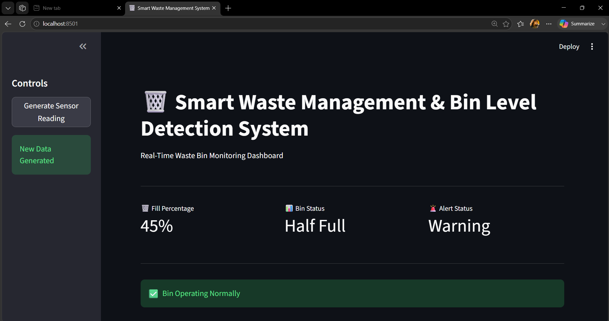
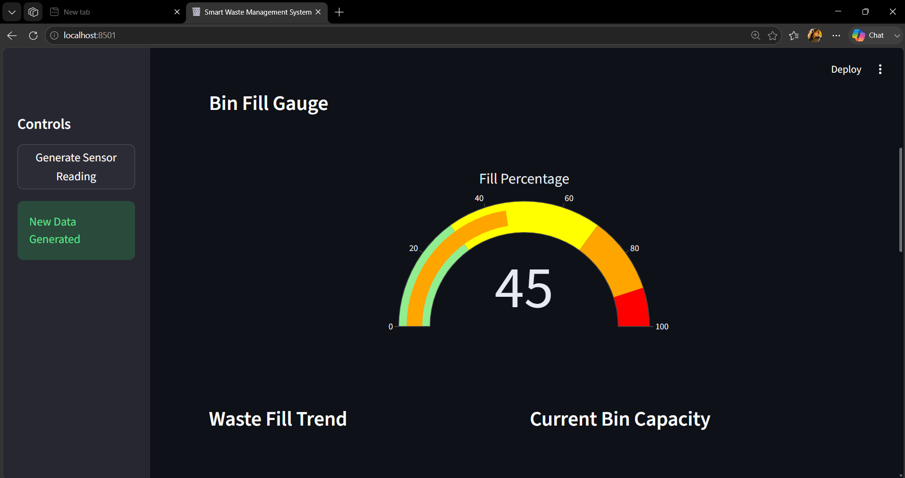
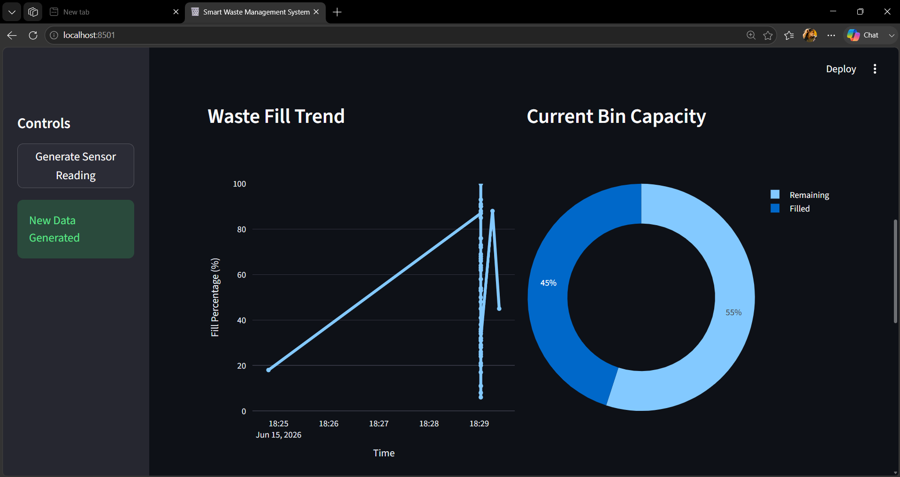
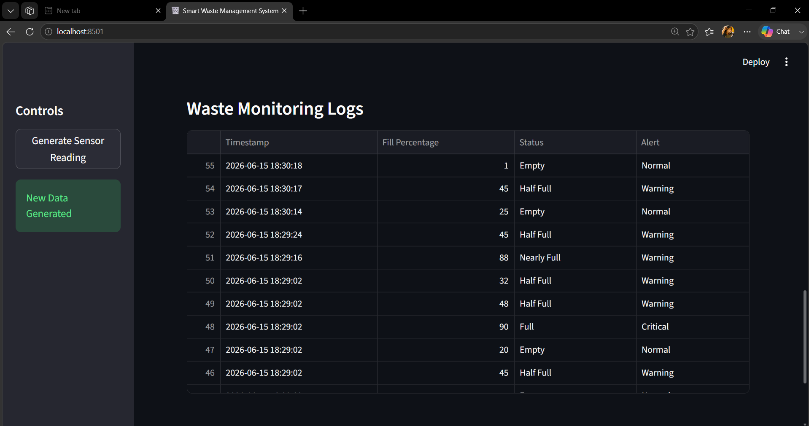
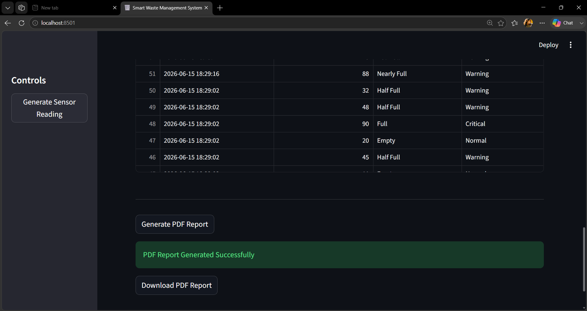

# 🗑️ Smart Waste Management & Bin Level Detection System

## 📌 Overview

The Smart Waste Management & Bin Level Detection System is an IoT-inspired web application developed using Python and Streamlit. The system simulates smart garbage bins by generating real-time waste level data, monitoring fill percentages, detecting bin status, generating alerts, visualizing trends, maintaining historical records, and producing downloadable PDF reports.

This project demonstrates how modern smart city solutions can optimize waste collection operations through intelligent monitoring and data-driven decision-making.

---

## 🎯 Problem Statement

Traditional waste collection systems follow fixed schedules regardless of the actual fill level of garbage bins. This often leads to:

* Overflowing bins causing environmental and health issues.
* Unnecessary collection trips increasing fuel consumption.
* Higher operational costs for municipalities.
* Inefficient resource utilization.

The Smart Waste Management System addresses these challenges by providing real-time waste level monitoring and alert generation for timely waste collection.

---

## 🚀 Features

* Real-Time Waste Bin Monitoring
* Fill Percentage Detection
* Smart Bin Status Classification
* Automated Alert Generation
* Interactive Streamlit Dashboard
* Waste Trend Visualization
* Historical Data Logging (CSV)
* PDF Report Generation
* Gauge Meter Visualization
* Pie Chart Analytics
* Waste Monitoring Logs
* Downloadable Reports

---

## 🛠️ Technology Stack

### Frontend

* Streamlit

### Backend

* Python

### Data Processing

* Pandas

### Data Visualization

* Plotly

### Reporting

* ReportLab

### Storage

* CSV Files

---

## 🏗️ Project Architecture

```text
Waste Bin Data
       │
       ▼
Data Simulation Engine
       │
       ▼
Fill Percentage Calculation
       │
       ▼
Status Detection
       │
       ▼
Alert Generation
       │
       ▼
Streamlit Dashboard
       │
       ▼
Charts & Analytics
       │
       ▼
CSV Logging & PDF Reports
```

---

## 📂 Project Structure

```text
Smart-Waste-Management-Bin-Level-Detection-System/

│
├── app.py
├── simulator.py
├── report_generator.py
├── requirements.txt
│
├── data/
│   └── waste_data.csv
│
├── outputs/
│   └── waste_report.pdf
│
├── images/
│   ├── image1.png
│   ├── image2.png
│   ├── image3.png
│   ├── image4.png
│   └── image5.png
│
└── README.md
```

---

## 📸 Project Screenshots

### Dashboard Overview



### Smart Bin Fill Gauge



### Waste Trend Analysis



### Waste Monitoring Logs



### PDF Report Generation



---

## ⚙️ Installation

Clone the repository:

```bash
git clone https://github.com/your-username/Smart-Waste-Management-Bin-Level-Detection-System.git
```

Navigate to the project directory:

```bash
cd Smart-Waste-Management-Bin-Level-Detection-System
```

Install dependencies:

```bash
pip install -r requirements.txt
```

---

## ▶️ Run the Application

```bash
streamlit run app.py
```

Open your browser and visit:

```text
http://localhost:8501
```

---

## 📊 Dashboard Modules

### Bin Fill Gauge

Displays current bin fill percentage using an interactive gauge meter.

### Alert Monitoring

Generates Normal, Warning, and Critical alerts based on waste levels.

### Waste Trend Visualization

Shows historical waste fill trends using an interactive line chart.

### Capacity Distribution

Displays current filled and remaining capacity using a pie chart.

### Monitoring Logs

Maintains complete waste monitoring records in tabular format.

### PDF Reports

Generates downloadable waste monitoring reports for analysis and documentation.

---

## 📈 Sample Waste Status Logic

| Fill Percentage | Status      | Alert    |
| --------------- | ----------- | -------- |
| 0 - 29%         | Empty       | Normal   |
| 30 - 69%        | Half Full   | Warning  |
| 70 - 89%        | Nearly Full | Warning  |
| 90 - 100%       | Full        | Critical |

---

## 🌍 Real-World Applications

* Smart Cities
* Municipal Waste Management
* Universities & Campuses
* Railway Stations
* Airports
* Shopping Malls
* Residential Communities
* Corporate Parks

---

## 🔮 Future Enhancements

* ESP32 Integration
* Ultrasonic Sensor Integration
* ThingSpeak Cloud Dashboard
* Blynk Integration
* MQTT Communication
* Multi-Bin Monitoring
* Route Optimization
* AI-Based Waste Prediction
* Mobile Application Support

---

## 🎓 Learning Outcomes

Through this project, users can learn:

* IoT System Design Concepts
* Smart City Applications
* Dashboard Development
* Data Visualization
* Report Generation
* Real-Time Monitoring Systems
* Python Application Development

---

## 👨‍💻 Author

Developed as an IoT and Smart City Technology Project using Python and Streamlit to demonstrate intelligent waste monitoring, alert generation, reporting, and data visualization.

### If you found this project useful, consider giving it a ⭐ on GitHub.
